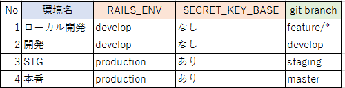

## コンテナど素人が、EC2からECSにシステムリプレースした話
2019年 7月 松田 弘樹
---

# はじめに
古きよきEC2のオンプレの構成から、ECS構成に乗せかえる案件を担当したので、そこで困ったことはまりポイントなどをまとめます。

---

## 現行サービス構成

|分類|内容|
| --- | --- |
|言語|Ruby 2.4.0 |
|フレームワーク|Ruby on Rails 5|
|ウェブサーバ |nginx|
|データベース |MariaDB|
|その他|GitHubEnterprise|

---

## リプレースでの対応内容
### Rubyのメジャーバージョンアップ
`2.4.0`から`2.6.2`に更新
### コンテナ技術の採用
ECS + fargateの構成で構築
### CI/CD自動化対応  
CircleCi、CodePipeline、Code3兄弟(CodeCommit,CodeBuild,CodeDeploy)の導入

---

## 着任時の筆者のスキル
### サービス開発
オンプレ/AWSでの新規ECサービスの構築、開発、保守運用、経験あり
### AWS
AWS暦3ヶ月  
AWS認定 クラウドプラクティショナー 所持  
### Ruby, コンテナ/Docker, CI/CD
素人

---

# 全般
開発の進め方とか  

---

## まずはサンプルを動かせるように
ハンズオン資料などを積極的に活用し、最初に動作するもの作ってからの修正、拡張をお勧めします。  
[AWS Well-Architected](https://aws.amazon.com/jp/architecture/well-architected/)の思想が反映されており、基礎的な部分(VPC、サブネット、セキュリティグループ)などを担保してくれます。  

---

## 質問できる環境を作る
構築経験のある有識者、またはAWSさんのSAに協力依頼して、質問できる環境を構築しましょう。  
変なはまり方をすると、一日進まないなんてこともありえます。  悩んだ上で有識者に相談してみたら、「実は見当違いな場所を調査していた」ということも。   
注意点として、複数人の意見を一度にまとめて聞くと、受け取る側の処理が追いつかず、混乱する可能性があります。

---

## 工数の見積もり
正確な見積もりがひつような場合は、分からないことを出来るだけ少なくしましょう。  
分からないことが多いと原因特定に時間がかります。  
分からないことの数だけ、特定する工数が倍ではなく乗算されると思ってください。  
エラーが同時が多発的に発生した場合には、思うように切り分けが出来ずに精神的にきつくなります。    

---

# AWS編

---

## IAM

---

### AWSルートアカウント 
アカウントの分割方針を検討しましょう。  
1アカウントで複数のシステムを管理しようとすると、検索などで非常に分かりにくくなります。  
切り分ける粒度としては、部署単位、システム単位、環境単位などになると思います。  

---

### 認証情報
チーム用の共通アカウントを作りましょう。  
個人のユーザから発行すると、離任したり退職したときにIDが削除されて動かなくなることがあります。

---

### ポリシー再作成時エラー
テスト用に作成したポリシー削除して作り直したが、CodeBuildでエラー発生。  
[quitaの記事](https://qiita.com/kyuaz/items/3da93bd05b1342212577) を参照して対応した。ポリシー削除時に、追加で消さなければいけなかったようです。
``` The policy is attached to 0 entities but it must be attached to a single role ```

---

## VPC
VPC中で複数サブネットを構築するので、大きめにとりましょう。  
VPCのIP範囲を`/24`で確保するとIP不足になるか、分断されすぎて分かりにくいIP帯になります。

---

### サブネット
内部セグメントと外部セグメントを分割し、それを MultiAZ構成としましょう。  

---

### private subnetから外部への接続不可
EIP、natgwやigw、ルートテーブルの設定を確認しましょう。  

---

###  DNS登録、SSL証明書発行
route53のAレコードが必要です。  
サブドメインや、ALBなどにはCレコードの紐付け登録などをしましょう。  
ACMを利用した無料SSH証明書の発行には、AWSのサポート経由でのにホワイトリストに登録の申請が必要な場合があります。

---

## EC2
動作確認用のEC2を作成しておくと、問題の切り分けに使えます。 
料金節約のため、不用な場合はインスタンスを落としておきましょう。

---

## ALB
ALBから内部セグメントに転送するときのポートは80番ポートで通信しましょう。  
内部で受ける側にSSL証明書を設定する必要がなくなります。  

---

## RDB
デフォルト値だと、timezoneがUTCとなっているため日本時間とはズレています。構築時など早めの段階で修正しましょう。   
パラメータグループの新規作成、パラメータの更新、反映にRDB再起動が必要になるため、早いタイミングで修正するとよいです。

---

## S3
GUIからバケットをコピーをしても、AWSバケットポリシーまではコピーされないので注意しましょう。

---

# ECS
みんな大好きECS

---

## ログの出力先について
コンテナの特性上、コンテナ内に出力しているログは、コンテナが停止してしまうと破棄されてしまいます。  
要件によっては、出力先をS3などに変更しましょう。

---

## Fargate環境のデバッグ
Fargateは起動コンテナへのSSHログインなどはできないです。  
docker-composeでローカル開発環境を用意するか、開発環境を用意してSSH接続できるEC2を選択しましょう。

---

# コンテナ編

---

## 公式imageサポート期限
`docker build`時に必要なソフトウエアのインストールすることがあると思います。  
古いubuntuイメージを使っていると、apt-getでエラーが出る事例がありました。  
原因は、[古いバージョンの情報が、ミラーサイトからの削除されたため](https://gihyo.jp/admin/clip/01/linux_dt/201903/25)  
対応としては、imageのバージョンを上げることで対応しました。  

---
## 公式imageサポート期限

利用しているOSのサポート期限がいつか意識しておくとよいです。  
サポート期限が切れているものは、明日にでもDockerfileが使えなくなるものとして早急に更新をお勧めします。  

---

## docker-compose
当初自分は、DockerfileだけでECS+fargateを構築できると思っていました。  
しかし、開発を進めるにつれてdocker-composeを作っておくと、次の利点があると分かったので作成をお勧めします。  
- 不具合が発生した場合のデバッグ環境の用意。  
- ECSタスク定義と近い環境となり、本番環境作成にスムーズに移行しやすい。  

---

## バックグラウンド実行
プロセス起動コマンドをDockerfileで記載する場合、バックグラウンド実行オプションは外しましょう。  
Dockerfile側でバックグラウンドオプションをつけると、コンテナそのものが停止してしまいます。  
バックグラウンド起動したい場合は、`docker run`に`-d`オプションをつけて実行しましょう。  

---

## alpine
軽量なコンテナとして有用ですが、注意点もありました。

---

### ログインシェル
bashではなくash
```
# ログインシェル指定まちがえでエラーとなる
docker run --rm -it test-image bash
# 以下ならOK
docker run --rm -it test-image ash
docker run --rm -it test-image sh
```

---

### Gemライブラリが動かなくなった
フロント用のリポジトリで`docker run`したところ、次のエラーが発生。  
```mini_racer_extension.so: undefined symbol: ```   
エラーを調査したが、有効な解決方法がみつけられませんでした。  
alpineとgemの相性問題という最終判断し、alpineを断念してruby公式のDocker imageを利用しました。  

---

# Ruby編

---

## puma利用
今回の構成では、次のようなwebサーバが機能が不要になりました。  
- Dockerfileのnginxを起動する 
- rubyが出力するnginxソケット定義  

---

## ログの標準出力
直接コンテナに入ってログを確認できません。  
CloudWatchLogsで確認できるように、すべて標準出力するように設定変更しました。  

---

## バージョンアップの影響
更新された際に、`config/database.yml` が必要となっていました。  
本来、不要な設定ファイルですが、後日調査対応としました。
- 影響が少ない。
- 納期優先の意向がある

---

# CI/CD編

---

## AWS Code3兄弟
### yamlファイル
改行、インデントが厳密に判定されます。動くサンプル見ながら試行錯誤してました。  

---

### 対話モード
CI/CDの性質上、対話モードでの動作を想定していません。対話を求められないようにしましょう。  
対話モードになるコマンド例   
- rmコマンド  
- パッケージ管理系コマンド(yum,apt-get,apk)  

---

### リポジトリ管理
構成上、gitのリポジトリが2つになることがあります。 
正規のCI/CDフローを無視しての、直接gitリポジトリの更新操作はやめましょう。  
ソース不一致による衝突の原因になり、復旧に時間がかかります。  

---

### DBの更新
DB更新機能(railsではdb:migrate)は、実行する場所はAWS内部から実行しましょう。  
AWS外からdb:migrateを実行するには、インターネットからRDSへの接続許可設定が必要になり、セキュリティリスクが高まります。

---

## [The Twelve-fatrot App](https://12factor.net/ja/) 
`開発/本番一致`に従い、同一コンテナを使いましょう。  
環境ごとに変える必要があるものは、環境変数で切り替えましょう。

---

### RAILS_ENVとgit branchの組み合わせ
  
RAILS_ENVでデフォルト設定で指定可能な値は、`test`,`develop`,`prodcution`の３つになります。  
gitのフローにおいて`staging`ブランチを作成している場合は、対応するRAILS_ENVの値が存在しないため混乱しやすいです。  
`開発/本番一致`に従い、STGと環境の本番環境を作成をしましょう。  

---

# できなかったこと
- CI/CDの結果をslackへ通知   
- ruby on railsのログ出力先をS3に設定  

---

# 参考資料

- AWSでのWeb標準構成ハンズオン  
Amazon Web Service Japan  
Solutions Architect 千葉さん

- 入門 Docker  
https://y-ohgi.com/introduction-docker/

---

# 質疑応答

---

# おわり
ご清聴ありがとうごさいました。
